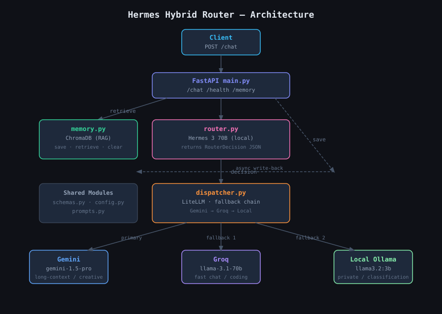

# Hermes Hybrid Router

A local-first AI router that classifies every incoming request with a local **Hermes 3 70B** model before dispatching it to the best available worker (LM Studio / LM Link, Gemini, Groq, or a bare Ollama model). Semantic conversation memory is persisted with ChromaDB.



## How it works

1. A request hits `POST /chat`.
2. The **router** (local Hermes 3) classifies the request and returns a JSON `RouterDecision` (target + confidence + optional worker system prompt).
3. Relevant prior context is retrieved from ChromaDB and injected into the worker prompt.
4. The **dispatcher** sends the request to the chosen worker, automatically falling back down the chain on failure.
5. The user/assistant turn is saved back into semantic memory.

## Prerequisites

- **Python 3.10+** (the code uses `X | Y` typing and `from __future__ import annotations`).
- A local router model, served one of two ways:
  - **LM Studio / LM Link** (default) exposing an OpenAI-compatible API on `http://localhost:1234/v1`, loaded with a Hermes 3 model, **or**
  - **Ollama** on `http://localhost:11434` (set `ROUTER_BACKEND=ollama`).
- *(Optional)* **Gemini** and/or **Groq** API keys for cloud workers.

## Project structure

```
hermes/
├── __init__.py
├── schemas.py      # Pydantic contracts (UserMessage, RouterDecision, WorkerTarget, ...)
├── config.py       # Env-var settings (pydantic-settings)
├── prompts.py      # Router system prompt + worker memory-injection template
├── memory.py       # ChromaDB RAG layer (save / retrieve / clear)
├── router.py       # Local Hermes 3 → RouterDecision (LM Studio or Ollama backend)
├── dispatcher.py   # LiteLLM dispatch + fallback chain
└── main.py         # FastAPI app
tests/test_client.py # Integration tests (require a running server)
```

## Quick start

```bash
# 1. (Choose ONE router backend)
#    a) LM Studio / LM Link (default): start LM Studio, load a Hermes 3 model,
#       and enable its local server on port 1234.
#    b) Ollama: pull the models, then set ROUTER_BACKEND=ollama in .env
ollama pull hermes3:70b && ollama pull llama3.2:3b

# 2. Configure
cp .env.example .env        # paste Gemini + Groq keys; pick ROUTER_BACKEND

# 3. Install deps (a virtualenv is recommended)
python -m venv .venv && source .venv/bin/activate
pip install -r requirements.txt

# 4. Run
uvicorn hermes.main:app --reload --port 8000
```

## Endpoints

| Method | Path                                  | Description                          |
| ------ | ------------------------------------- | ------------------------------------ |
| POST   | `/chat`                               | Route a message and respond          |
| POST   | `/chat?stream=true`                   | Same, but stream tokens via SSE      |
| GET    | `/health`                             | LM Studio / Ollama + Chroma status   |
| GET    | `/memory/{session_id}?query=…`        | Semantic recall for a session        |
| DELETE | `/memory/{session_id}`                | Clear a session's memory             |

### Streaming

Pass `?stream=true` to `/chat` (or set `STREAM_DEFAULT=true` in `.env`) to receive a
`text/event-stream` of `data:` events. Each event carries a token and the worker target;
the stream ends with `data: [DONE]`.

## Fallback chain

```
LM Studio → Gemini → Groq → Local Ollama
```

Dispatch starts at the target the router picked and walks down this chain. A failure at any
target is swallowed and the next target is tried automatically; if the final local target also
fails, the error is raised.

## Configuration

All settings live in `.env` (see `.env.example`) and are loaded by `hermes/config.py`. Key vars:

| Variable          | Default                          | Purpose                                  |
| ----------------- | -------------------------------- | ---------------------------------------- |
| `ROUTER_BACKEND`  | `lmstudio`                       | Router backend: `lmstudio` or `ollama`   |
| `LMSTUDIO_BASE_URL` | `http://localhost:1234/v1`     | LM Studio / LM Link OpenAI endpoint      |
| `OLLAMA_BASE_URL` | `http://localhost:11434`         | Ollama endpoint                          |
| `GEMINI_API_KEY`  | *(empty)*                        | Enables the Gemini worker                |
| `GROQ_API_KEY`    | *(empty)*                        | Enables the Groq worker                  |
| `CHROMA_PERSIST_DIR` | `.chroma`                     | On-disk ChromaDB location                |
| `STREAM_DEFAULT`  | `false`                          | Stream every response by default         |

## Running the tests

The tests in `tests/test_client.py` are **integration tests** that hit a live server. Start the
app first, then run pytest in a second shell:

```bash
uvicorn hermes.main:app --port 8000      # shell 1
pytest                                   # shell 2
```

## Troubleshooting

- **`/health` shows `degraded`** — the active router backend or ChromaDB isn't reachable. Check
  that LM Studio's server is on (or Ollama is running) and that `ROUTER_BACKEND` matches.
- **All dispatch targets fail** — confirm at least one worker is reachable: a local model, or a
  valid `GEMINI_API_KEY` / `GROQ_API_KEY`.
- **Empty memory results** — memory is per `session_id`; recall only returns chunks saved under the
  same session.

See [CONTRIBUTING.md](CONTRIBUTING.md) for development setup and conventions.
